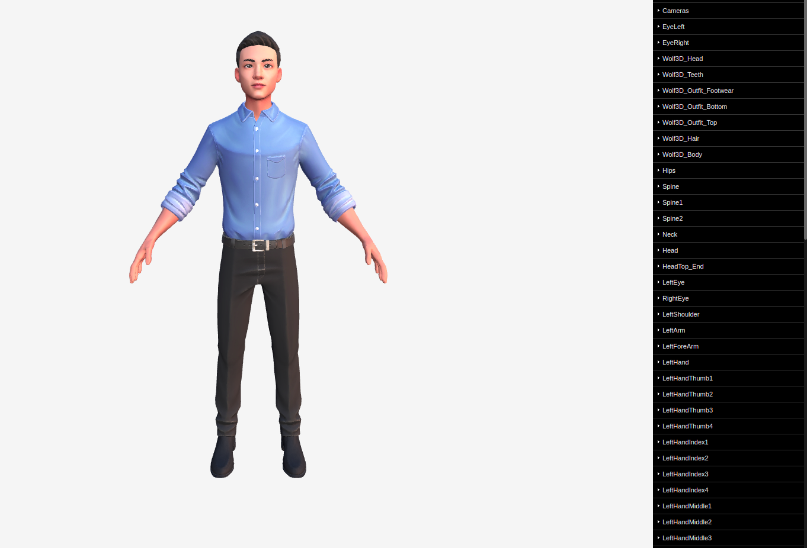

# 3D Human Model with Animation using Three JS

Website : https://hmthanh.github.io/3d-human-model/

* <Bone> Hips

* <Bone> Spine

* <Bone> Spine1

* <Bone> Spine2

* <Bone> Neck

* <Bone> Head

* <Bone> HeadTop_End

* <Bone> LeftEye

* <Bone> RightEye

* <Bone> LeftShoulder

* <Bone> LeftArm

* <Bone> LeftForeArm

* <Bone> LeftHand

* <Bone> LeftHandThumb1

* <Bone> LeftHandThumb2

* <Bone> LeftHandThumb3

* <Bone> LeftHandThumb4

* <Bone> LeftHandIndex1

* <Bone> LeftHandIndex2

* <Bone> LeftHandIndex3

* <Bone> LeftHandIndex4

* <Bone> LeftHandMiddle1

* <Bone> LeftHandMiddle2

* <Bone> LeftHandMiddle3

* <Bone> LeftHandMiddle4

* <Bone> LeftHandRing1

* <Bone> LeftHandRing2

* <Bone> LeftHandRing3

* <Bone> LeftHandRing4

* <Bone> LeftHandPinky1

* <Bone> LeftHandPinky2

* <Bone> LeftHandPinky3

* <Bone> LeftHandPinky4

* <Bone> RightShoulder

* <Bone> RightArm

* <Bone> RightForeArm

* <Bone> RightHand

* <Bone> RightHandThumb1

* <Bone> RightHandThumb2

* <Bone> RightHandThumb3

* <Bone> RightHandThumb4

* <Bone> RightHandIndex1

* <Bone> RightHandIndex2

* <Bone> RightHandIndex3

* <Bone> RightHandIndex4

* <Bone> RightHandMiddle1

* <Bone> RightHandMiddle2

* <Bone> RightHandMiddle3

* <Bone> RightHandMiddle4

* <Bone> RightHandRing1

* <Bone> RightHandRing2

* <Bone> RightHandRing3

* <Bone> RightHandRing4

* <Bone> RightHandPinky1

* <Bone> RightHandPinky2

* <Bone> RightHandPinky3

* <Bone> RightHandPinky4

* <Bone> LeftUpLeg

* <Bone> LeftLeg

* <Bone> LeftFoot

* <Bone> LeftToeBase

* <Bone> LeftToe_End

* <Bone> RightUpLeg

* <Bone> RightLeg

* <Bone> RightFoot

* <Bone> RightToeBase

* <Bone> RightToe_End

* <SkinnedMesh> EyeLeft

* <SkinnedMesh> EyeRight

* <SkinnedMesh> Wolf3D_Head

* <SkinnedMesh> Wolf3D_Hair

* <SkinnedMesh> Wolf3D_Teeth

* <SkinnedMesh> Wolf3D_Outfit_Footwear

* <SkinnedMesh> Wolf3D_Outfit_Bottom

* <SkinnedMesh> Wolf3D_Outfit_Top

* <SkinnedMesh> Wolf3D_Body
